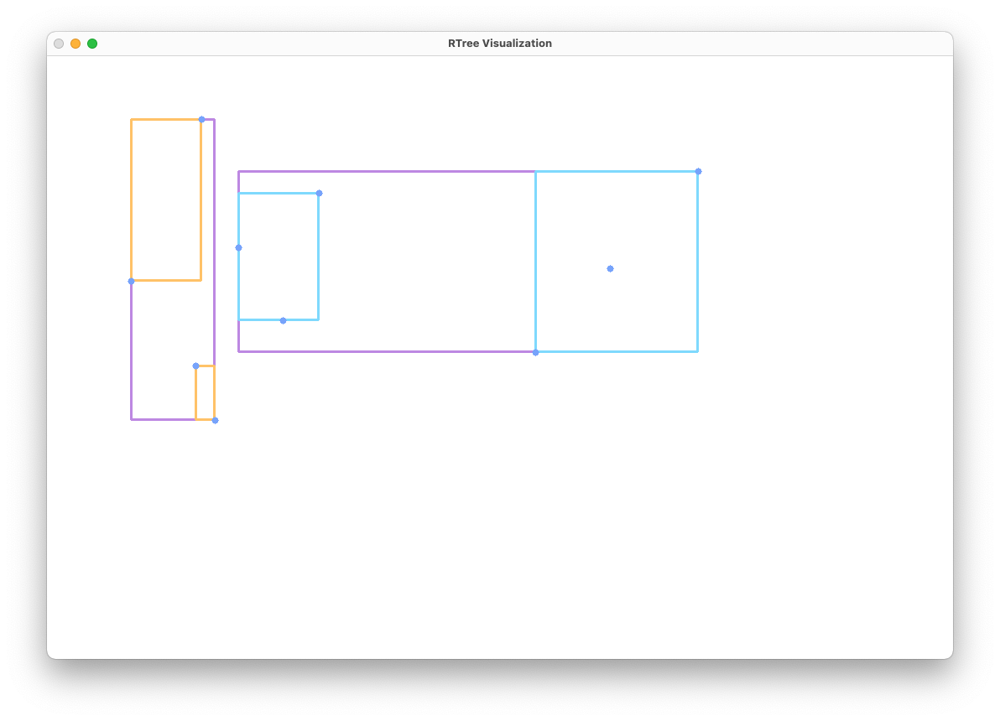

# RTree
Implementación de un R-Tree con visualización

## Dependencias
* cmake
* opencv
## Como correr?
```shell
mkdir build
cd build
cmake ..
make
./RTree
```
## Como usar?
* Al dar click izquierdo empezaras a dibujar un poligono hasta que le des al punto inicial
* Insertar puntos con ALT + click izquierdo
* Eliminar un punto o poligono con click derecho
